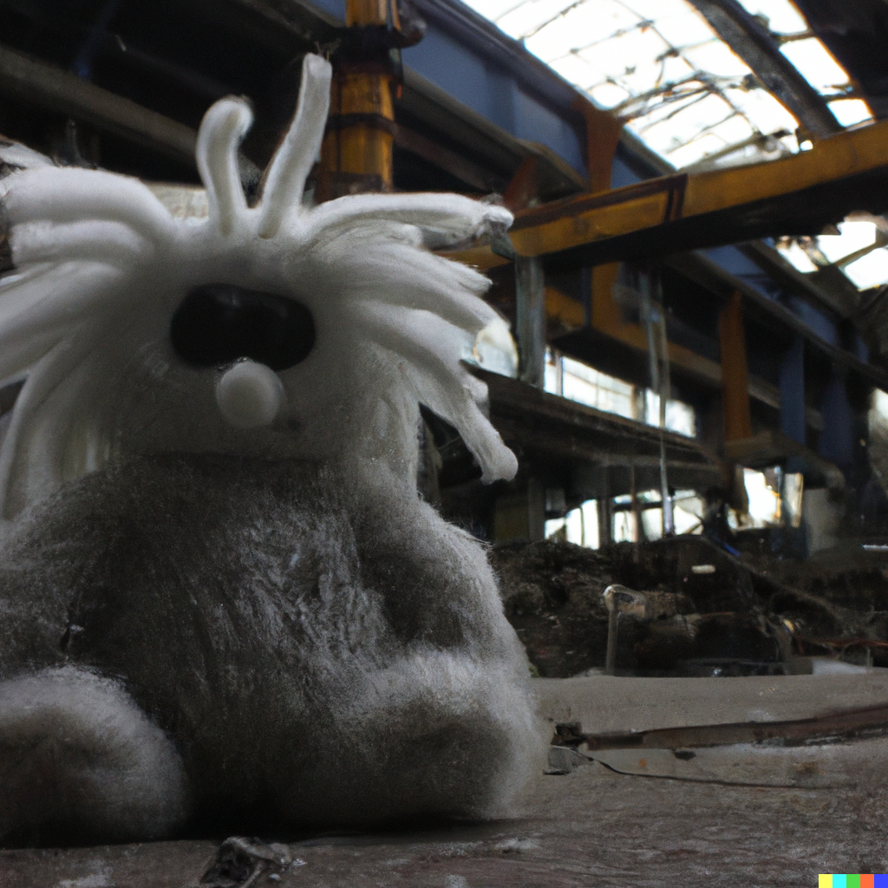

# Micrograd Rust - A Neural Network in Rust
A Rust-adoption of [Andrej Karpathy's micrograd](https://github.com/karpathy/micrograd) implementation.

A feedforward artificial neural network. Implements backpropagation over a dynamically built DAG and a small neural networks library on top of it with a PyTorch-like API.



## Features

- **Neurons**: Basic building block for the layers.
- **Layers**: A collection of neurons that can be stacked together.
- **MLP** (Multi-Layer Perceptron): A feedforward artificial neural network.
- **Value**: The DAG implementing backpropagation.

## Usage

```Rust
// Create the Network with 2 hidden layers (4 neurons each)
let mlp: MLP = MLP::new(3, vec![4, 4, 1]);

// The test data
let xs: Vec<Vec<f64>> = vec![
    vec![2.0, 3.0, -1.0],
    vec![3.0, -1.0, 0.5],
    vec![0.5, 1.0, 1.0],
    vec![1.0, 1.0, -1.0],
];

// Desired targets
let ys = vec![
    Value::new(1.0),
    Value::new(-1.0),
    Value::new(-1.0),
    Value::new(1.0),
];

for _ in 0..100 {
    // forward pass
    let y_pred: Vec<Value> = xs.iter().map(|x| mlp.call(x.clone())).collect();

    let mut loss: Value = Value::new(0.0);

    for i in 0..ys.len() {
        let d = y_pred[i].clone() - ys[i].clone();
        let d_sq = d.pow(2.0);
        loss = loss + d_sq;
    }

    // reset the gradients
    for p in mlp.parameters() {
        p.borrow_mut().grad = 0.0;
    }

    // backpropagation and gradient adjustment
    loss.backward();
    for p in mlp.parameters() {
        let grad = p.borrow().grad;
        p.borrow_mut().data -= 0.01 * grad;
    }
}
```

## License

This project is licensed under the MIT License.